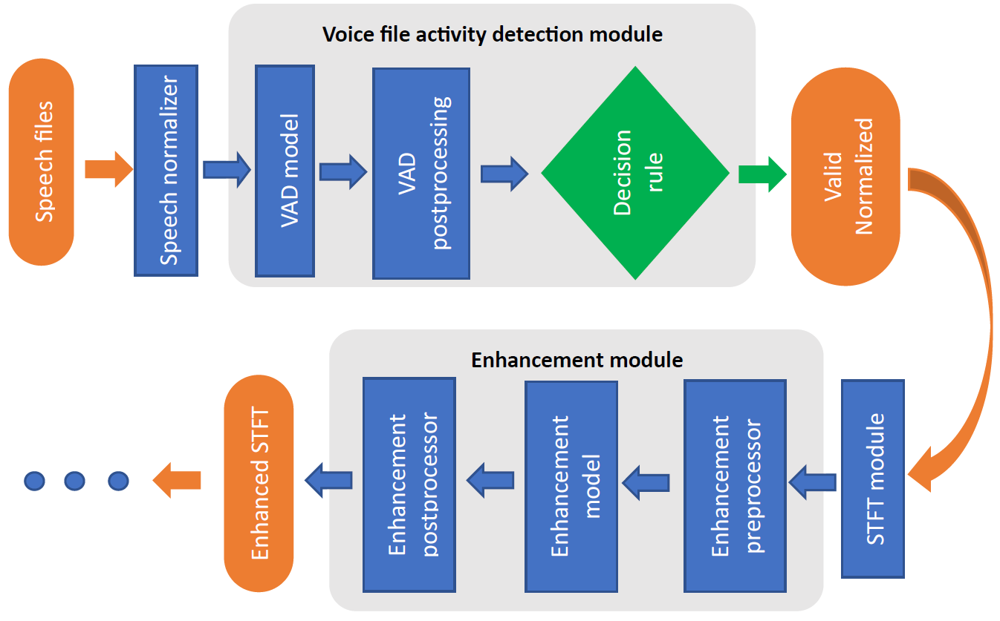

# Electronics Research Institute, Sharif University of Technology

## Proposed Framework of Project's Modules
The proposed framework is a combination of two main modules introduced in different project phases. These two main modules are:
1. Voice Activity Detection(VAD) module
2. Speech Enhancement module

Consequently, the human hearing experience has been enhanced by implementing the best pretrained model and config for each module. For the VAD module, Pyannote-v2.3 was employed, and for the enhancement module, GAGNet-v4_pip was utilized. The introduced decision criteria works as a valid audio file recognition module.

## Table of Contents
- [Overview](#overview)
- [Block Diagram](#block-diagram)
- [Dataset](#dataset)
- [Requirements](#requirements)
- [Usage](#usage)
- [Contribution](#contribution)
- [License](#license)

## Overview
The proposed framework starts with inputting a group of audio signals into the Speech normalizer for normalization. Then, the voice activity detection model identifies speech and non-speech in each sound frame. The initial batch undergoes removal of invalid sounds (sounds without speech) using audio file decision criteria and post-processing block, before being processed by the STFT module of the employer encoder. At this stage, the STFT of the valid voice category is entered into the speech enhancement module, which is first pre-processed in the frequency domain according to the GAGNet model, and then entered into the speech enhancement module. Following this step, the speech improvement post-processing block yields the enhanced STFT of the valid speech at the output. The remaining steps of the employer encoder are carried out based on encoder layers.

**Note:** To implement this framework, you can use the CPU from the beginning to the end of the valid speech file recognizer module, and GPU can be used for the rest of the pipeline.


## Block Diagram
The overall architecture of the implemented framework is shown below:

<p align="center"></p>

## Dataset 
**Note1: For inference of the models, you should put unzipped data in [**Noisy_Dataset_V1**](./dataset/Noisy_Dataset_V1),  [**Noisy_Dataset_V2**](./dataset/Noisy_Dataset_V2) and [**SAD_noise_dataset**](./dataset/SAD_noise_dataset).**

**Note2: For running the codes, it is necessary to unzip test_filenames.zip and SAD_noise_filenames.zip files in this [**folder**](./dataset)**

This [**folder**](../dataset) contains the DS-Fa-V04 dataset that was introduced in Phase-3 report. This dataset is used for test of VAD decision rule and in this repo, as a test dataset beacuse it has both valid and invalid noisy speech files to evaluate VAD module and enhancement module. In DS-Fa-V04 dataset, valid speech files were randomly selected from test part of DS-Fa-V01 dataset, and invalid speech files (total noise files) were created by QUT dataset with length 2 - 10 seconds. Both parts of DS-Fa-V04 dataset have equal samples, about 50000. 

## Requirements
- python (version 3.9.16).
- torch (version 2.0.1).
- torchaudio (version 2.0.2).
- other dependencies.

**Run the following code to install all the requirements and dependencies.**
```
pip install -r requirements.txt
```

## Usage

#### Run the following code with the desired settings to inference the model: ####

```bash
python inference.py -gagnet_name         [name of GAGNet models]
                    -pyannote_name       [name of VAD models]
                    -data_path           [path of main file of data]
                    -invalid_filenames   [name of samples file to load samples in data file]
                    -valid_filenames     [path_of_valid_data_filenames in data file]
```
#### For example: ####

```bash
python inference.py -gagnet_name "gagnet-v4"
                    -pyannote_name "pyannote-v2.3"
                    -data_path "./dataset"
                    -invalid_filenames "SAD_noise_filenames.txt"
                    -valid_filenames "test_filenames.csv"
```

## Contribution
We welcome contributions from the community! If you would like to contribute to the propesed framework, please follow these steps:
1. Fork the repository.
2. Create a new branch for your feature or bug fix.
3. Commit your changes and push your branch to your fork.
4. Submit a pull request with a detailed description of your changes.

## License
Ⓒ 2023 X. All rights reserved. 